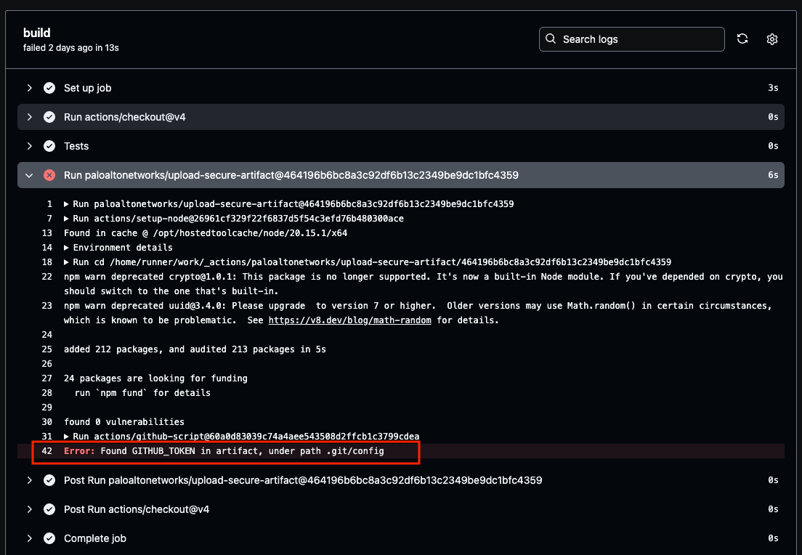

 


# Upload secure artifact

This GitHub action scans artifacts for secrets using [gitleaks](https://github.com/gitleaks/gitleaks) before uploading them. The upload functionality is performed using the [@actions/artifact](https://www.npmjs.com/package/@actions/artifact) package, which is also used by the [upload-artifact](https://github.com/actions/upload-artifact) GitHub action. The purpose of this action is to ensure that no secrets are included in the uploaded artifacts.
<br>
<br>
 

## Features

- Compatible with upload-artifact v4
- Alerts users if any secrets are detected
- Prevents uploading artifacts if secrets are found
- Wraps the `upload-artifact` GitHub action for seamless integration

## Usage

To use the action, add it to your GitHub Actions workflow file:

```yaml

    - uses: PaloAltoNetworks/upload-secure-artifact@main
       with:
         name: python-build
     	 path: /output

```

** _Pin your actions for a safer world_

## Inputs

- original upload-artifact inputs can be found [here](https://github.com/actions/upload-artifact?tab=readme-ov-file#inputs)

- scan-only-runner-token (Optional)

	-	Description: If true, skip the gitleaks secrets scanning and only perform scanning for the runner token (GITHUB_TOKEN) in the local .git folder.
	-	Default: false

## Outputs

-  artifact-id, artifact-url: supplied by the upload-artifact action


## Contributing

  Contributions are welcome! Please open an issue or submit a pull request if you have any improvements or suggestions.

## Contact

  For any questions or support, please open an issue on the GitHub repository.
